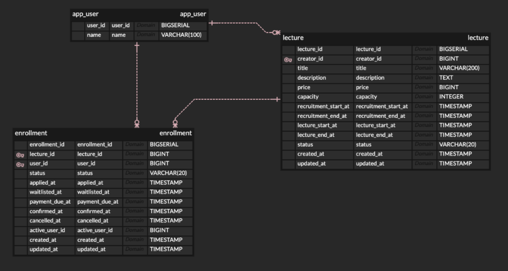

# LiveKlassProject

## 프로젝트 개요

본 프로젝트는 단일 DB 기반 CQRS-lite 구조를 적용하여 강의 등록, 강의 모집 상태 변경, 수강 신청, 결제 확정, 수강 취소, 대기열 승격을 처리하는 예제 프로젝트입니다.

현재 구현 범위는 다음과 같습니다.

- 강의 등록, 수정, OPEN, CLOSED 처리
- 수강 신청
- 결제 확정
- 수강 취소
- 취소 후 대기열 승격
- 강의 목록 조회
- 강의 상세 조회
- 내 수강 신청 목록 조회
- 강의별 수강생 목록 조회

## 기술 스택

| 항목 | 내용 |
|---|---|
| Language | Java 21 |
| Framework | Spring Boot 3.5.9 |
| Web | Spring Web |
| ORM | Spring Data JPA / Hibernate |
| Database | PostgreSQL |
| Security | Spring Security |
| Test | JUnit 5, Mockito, MockMvc |
| Build | Gradle |

## 실행 방법

### 1. 환경 변수 준비

루트의 `.env` 또는 실행 환경에 아래 값을 준비해야 합니다.

```properties
DB_URL=jdbc:postgresql://localhost:5432/liveklass
DB_USERNAME=postgres
DB_PASSWORD=postgres
JWT_SECRET=local-secret
JWT_ACCESS_EXP=5000000
JWT_REFRESH_EXP=1000000000
```

### 2. 애플리케이션 실행

```bash
./gradlew bootRun
```

또는 IDE에서 `LiveKlassClassEnrollApplication`의 `main()`을 실행하면 됩니다.

### 3. 실행 확인

- 기본 포트는 `8080`입니다.
- 현재 보안 설정은 모든 요청을 허용하도록 구성되어 있습니다.
- 실제 요청자 식별은 `userId` 요청 헤더로 처리합니다.

## 요구사항 해석 및 가정

### 사용자 식별

- 별도 로그인 또는 토큰 인증은 구현하지 않았습니다.
- 요청 헤더의 `userId`로 요청자를 식별하도록 가정하였습니다.

### 강의 상태

- 강의 상태는 `DRAFT -> OPEN -> CLOSED`만 사용합니다.
- 삭제 상태는 별도로 두지 않았습니다.
- `CLOSED`는 최종 상태로 간주하였습니다.

### 수강 신청 상태

- `PENDING`, `CONFIRMED`는 정원을 점유합니다.
- `WAITLISTED`, `CANCELLED`는 정원을 점유하지 않습니다.

### 대기열

- 별도 큐 자료구조는 두지 않았습니다.
- `Enrollment.status = WAITLISTED`가 대기열을 의미합니다.
- 대기 순서는 `waitlistedAt ASC`, `id ASC` 기준으로 판단합니다.

### 결제 마감

- 현재 구현은 `paymentDueAt`를 `min(신청 시각 + 24시간, 모집 마감 시각)` 규칙으로 설정합니다.
- `payment timeout` 자동 취소 역시 아직 미구현 상태입니다.

## 설계 결정과 이유

본 프로젝트는 설계 과정에서 상태 다이어그램과 시퀀스 다이어그램을 먼저 정리한 뒤 구현을 진행하였습니다. 관련 산출물은 `images` 폴더에 포함되어 있습니다.

- [ERD 스키마](images/schema.png)
- [수강신청 상태 다이어그램](images/수강신청_상태_다이어그램.png)
- [강의등록 상태 다이어그램](images/강의등록_상태_다이어그램.png)
- [수강신청 시퀀스 다이어그램](images/수강신청_시퀀스_다이어그램.png)
- [수강취소 및 WaitList 시퀀스 다이어그램](images/수강취소_및_WaitList_시퀀스_다이어그램_.png)

### CQRS-lite 분리

`command`는 상태 변경, `query`는 조회를 담당하도록 분리하였습니다. 완전한 CQRS는 아니지만, 상태 변경 규칙과 조회 조립 책임을 분리하기에는 충분한 구조라고 판단하였습니다.

### Entity 최소 책임

엔티티는 상태와 시각 정보 보관, 그리고 최소한의 상태 변경 메서드만 가지도록 구성하였습니다. 복잡한 규칙은 서비스와 정책 객체로 분리하여 역할을 명확히 하였습니다.

### DB 기반 대기열

대기열은 별도 메모리 큐가 아니라 DB 행으로 표현하였습니다. 동시성 제어와 영속성 관점에서 과제 구조에 더 적합하다고 판단하였습니다.

### 비관적 락 사용

수강 신청과 취소, 승격 과정에서 정원 경합이 발생할 수 있으므로 `PESSIMISTIC_WRITE`를 사용하였습니다. 이를 통해 마지막 좌석 경쟁 상황에서도 `PENDING + CONFIRMED`가 정원을 초과하지 않도록 통제하고자 하였습니다.

### 단순 보안

Spring Security는 기본 인증 흐름 대신 모든 요청을 허용하도록 두고, `userId` 헤더만으로 요청자를 구분하도록 구성하였습니다. 이는 요구사항의 “인증/인가는 단순화 가능” 조건을 반영한 결정입니다.

## 설계 및 구현 과정

본 프로젝트는 요구사항을 그대로 코드로 옮기기보다, 먼저 상태 전이와 주요 유스케이스를 시각적으로 정리한 뒤 구현을 진행하였습니다.

설계 과정은 다음 순서로 진행하였습니다.

1. 요구사항 명세서를 바탕으로 강의 상태와 수강 신청 상태를 정리하였습니다.
2. 상태 전이의 복잡성을 고려하여 `query`와 `command`를 분리하는 CQRS-lite 구조를 확정하였습니다.
3. 강의 등록 및 수강 신청 흐름을 상태 다이어그램과 시퀀스 다이어그램으로 정리하였습니다.
4. API 명세를 먼저 정리한 뒤, 해당 명세를 기준으로 컨트롤러를 구현하였습니다.
5. `Lecture`, `Enrollment`, `AppUser` 엔티티를 직접 설계하고, 상태 전이와 대기열 규칙을 반영하였습니다.
6. 서비스 계층은 상태 다이어그램을 기준으로 작성하여, 상태 전이가 서비스 로직 안에서 일관되게 통제되도록 구성하였습니다.
7. 테스트는 계층별로 분리하여 작성하였습니다.
   - `ControllerTest`: API 요청과 응답, 헤더 전달 검증
   - `ServiceTest`: 비즈니스 로직과 상태 변경 검증
   - `StateTransitionSimulationBasedTest`: 상태 다이어그램의 모든 전이 검증
   - `EnrollmentConcurrencySimulationBasedTest`: 정원 초과 시 대기열이 실제로 쌓이는지 검증

설계 과정에서 작성한 UML 산출물은 아래와 같습니다.

- [ERD 스키마](images/schema.png)
- [수강신청 상태 다이어그램](images/수강신청_상태_다이어그램.png)
- [강의등록 상태 다이어그램](images/강의등록_상태_다이어그램.png)
- [수강신청 시퀀스 다이어그램](images/수강신청_시퀀스_다이어그램.png)
- [수강취소 및 WaitList 시퀀스 다이어그램](images/수강취소_및_WaitList_시퀀스_다이어그램_.png)

## AI 사용 범위

본 프로젝트에서는 AI를 보조 도구로 활용하였으며, 사용 범위는 다음과 같습니다.

### 직접 작성 및 직접 결정한 부분

- 요구사항 명세서 작성
- ERD 작성
- API 명세서 초안 작성
- 상태 다이어그램 작성
- 시퀀스 다이어그램 작성
- 상태 전이의 복잡성을 고려하여 `query`와 `command`를 분리하는 CQRS 설계 방식 확정
- 엔티티 구조와 핵심 도메인 방향 결정

### AI를 활용한 부분

- 직접 작성한 API 명세를 바탕으로 컨트롤러 코드 구현 보조
- 직접 설계한 상태 다이어그램을 기준으로 서비스 로직 구현 보조
- JUnit과 Mockito를 활용한 `ServiceTest`, `ControllerTest` 작성 보조
- 상태 다이어그램의 모든 전이를 검증하는 `StateTransitionSimulationBasedTest` 작성 보조
- 정원 초과 시나리오를 바탕으로 대기열 적재를 검증하는 `EnrollmentConcurrencySimulationBasedTest` 작성 보조
- PostgreSQL 기반 `IntegratedTest` 작성 보조
- 통합 테스트용 SQL 더미 데이터 및 정리 스크립트 작성 보조
- README, API 문서, UML 보조 문서 정리 보조

### 최종 책임 범위

- 요구사항 해석
- 구조 설계 결정
- 상태 모델 정의
- 테스트 범위 결정
- 코드 반영 여부 판단

위 항목은 모두 작성자가 직접 검토하고 최종 결정하였습니다.

## API 목록 및 예시

구현된 API의 상세 명세는 [guide/api.md](guide/api.md)에 정리되어 있습니다.

요약은 다음과 같습니다.

| 구분 | 메서드 | 경로 |
|---|---|---|
| Command | `POST` | `/api/command/lectures` |
| Command | `PUT` | `/api/command/lectures/{lectureId}` |
| Command | `POST` | `/api/command/lectures/{lectureId}/open` |
| Command | `POST` | `/api/command/lectures/{lectureId}/close` |
| Command | `POST` | `/api/command/lectures/{lectureId}/enrollments` |
| Command | `POST` | `/api/command/enrollments/{enrollmentId}/confirm-payment` |
| Command | `POST` | `/api/command/enrollments/{enrollmentId}/cancel` |
| Query | `GET` | `/api/query/lectures?statuses={status1,status2}&page={page}&size={size}` |
| Query | `GET` | `/api/query/lectures/{lectureId}` |
| Query | `GET` | `/api/query/enrollments/me?page={page}&size={size}` |
| Query | `GET` | `/api/query/lectures/{lectureId}/students?statuses={status1,status2}` |

샘플 요청과 응답 역시 [guide/api.md](guide/api.md)에 포함되어 있습니다.
강의 목록 조회의 `statuses` 파라미터는 선택값이며, 전달하지 않으면 전체 상태를 대상으로 조회합니다. 여러 상태를 함께 조회할 때는 `OPEN,CLOSED`와 같이 쉼표로 구분합니다.

## 데이터 모델 설명

ERDCloud로 작성한 현재 스키마는 아래 이미지와 같습니다.



현재 데이터 모델은 `AppUser`, `Lecture`, `Enrollment` 3개 엔티티를 중심으로 구성되어 있습니다.

### AppUser

| 필드 | 설명 |
|---|---|
| `id` | 사용자 ID입니다. |
| `name` | 사용자 이름입니다. |

### Lecture

| 필드 | 설명 |
|---|---|
| `id` | 강의 ID입니다. |
| `creator` | 강의 등록자입니다. |
| `title` | 강의 제목입니다. |
| `description` | 강의 설명입니다. |
| `price` | 강의 가격입니다. |
| `capacity` | 정원입니다. |
| `recruitmentStartAt` | 모집 시작 시각입니다. |
| `recruitmentEndAt` | 모집 종료 시각입니다. |
| `lectureStartAt` | 강의 시작 시각입니다. |
| `lectureEndAt` | 강의 종료 시각입니다. |
| `status` | `DRAFT`, `OPEN`, `CLOSED` 상태를 가집니다. |

### Enrollment

| 필드 | 설명 |
|---|---|
| `id` | 수강 신청 ID입니다. |
| `lecture` | 대상 강의입니다. |
| `user` | 신청자입니다. |
| `status` | `WAITLISTED`, `PENDING`, `CONFIRMED`, `CANCELLED` 상태를 가집니다. |
| `appliedAt` | 신청 시각입니다. |
| `waitlistedAt` | 대기 등록 시각입니다. |
| `paymentDueAt` | 결제 마감 시각입니다. |
| `confirmedAt` | 결제 확정 시각입니다. |
| `cancelledAt` | 취소 시각입니다. |
| `activeUserId` | 활성 신청 중복 방지용 읽기 전용 필드입니다. |

## 테스트 실행 방법

### 단위 테스트

```bash
./gradlew test
```

현재 단위 테스트는 다음과 같이 구성되어 있습니다.

- `ControllerTest`: MockMvc standalone + mocked service 방식입니다.
- `ServiceTest`: JUnit 5 + Mockito 기반입니다.
- `StateTransitionSimulationBasedTest`: 상태 전이 시뮬레이션 검증용 테스트입니다.

### 통합 테스트

실제 PostgreSQL에 연결하여 동작을 검증하는 통합 테스트도 포함되어 있습니다.

- `LectureQueryIntegratedTest`: 강의 목록/상세 조회 검증
- `EnrollmentQueryIntegratedTest`: 강의별 수강생 조회 검증
- `EnrollmentCommandIntegratedTest`: 수강 신청 및 `paymentDueAt` 반영 검증

예시는 다음과 같습니다.

```bash
./gradlew test --tests "com.liveklass.integration.*"
```

### 동시성 검증 테스트

동시성 테스트는 실제 DB와 트랜잭션, 락이 필요하므로 PostgreSQL 연결이 살아 있어야 합니다.

예시는 다음과 같습니다.

```bash
./gradlew test --tests "*EnrollmentConcurrencySimulationBasedTest"
```

주의사항은 다음과 같습니다.

- 현재 환경에서는 Gradle wrapper 다운로드 또는 네트워크 제약에 따라 실행이 제한될 수 있습니다.
- PostgreSQL 연결 정보가 없으면 통합 테스트와 동시성 테스트는 실패합니다.
- 통합 테스트와 동시성 테스트는 실제 DB 스키마를 기준으로 동작하므로, 엔티티 매핑을 변경한 뒤에는 현재 테스트 DB 스키마가 코드와 일치하는지 확인해야 합니다.
- `application.yml`의 JPA DDL 설정을 `update`로만 두고 기존 스키마를 재사용하면, 컬럼 정의 변경이 충분히 반영되지 않아 테스트가 실패할 수 있습니다.
- 통합 테스트용 더미 데이터는 `src/test/resources/sql` 경로의 SQL 스크립트로 직접 적재되므로, 테스트 대상 DB에 동일한 테이블 구조가 먼저 준비되어 있어야 합니다.
